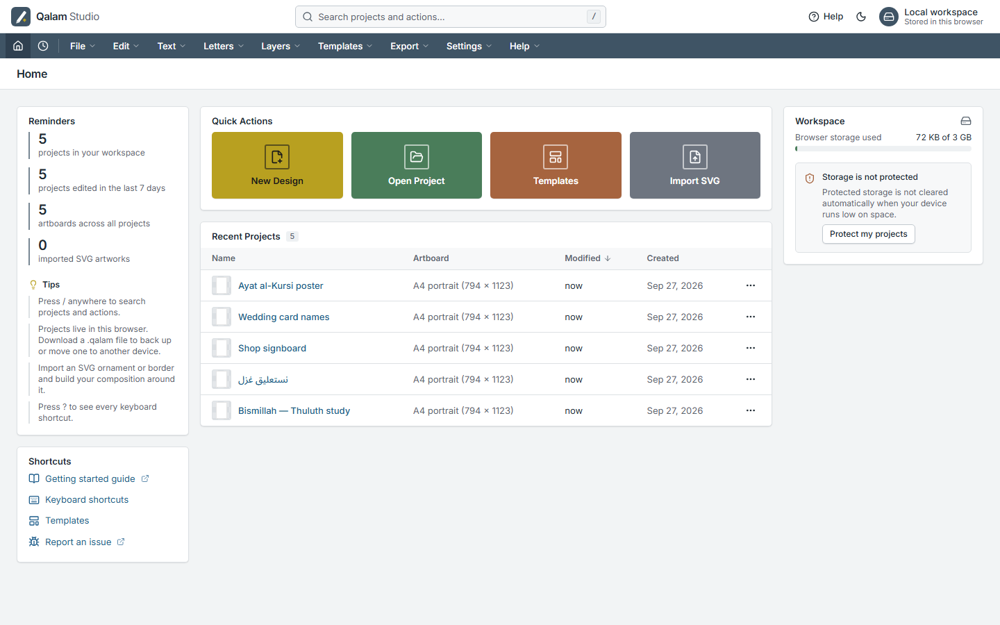
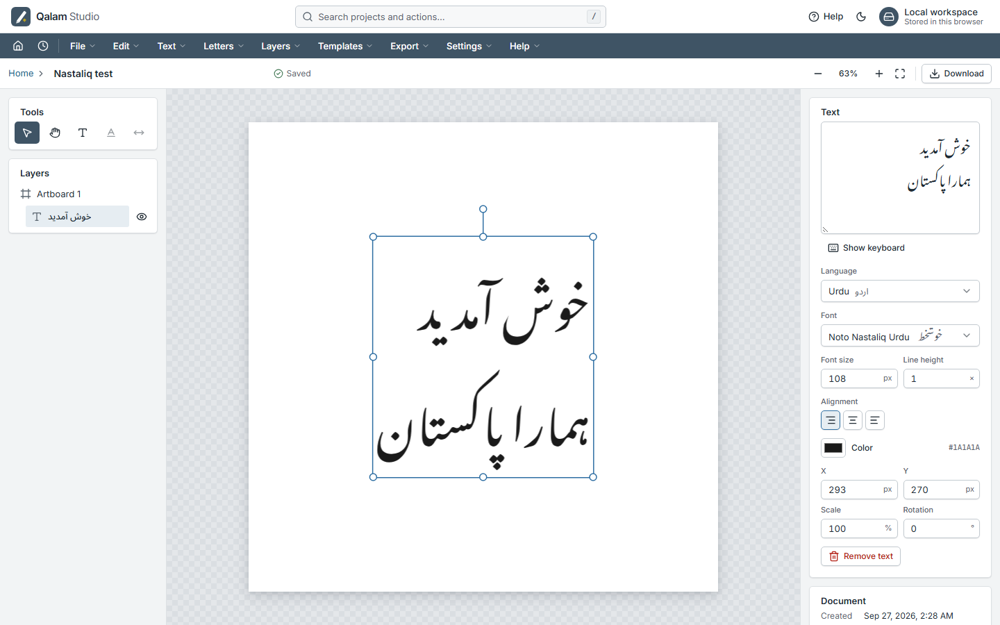
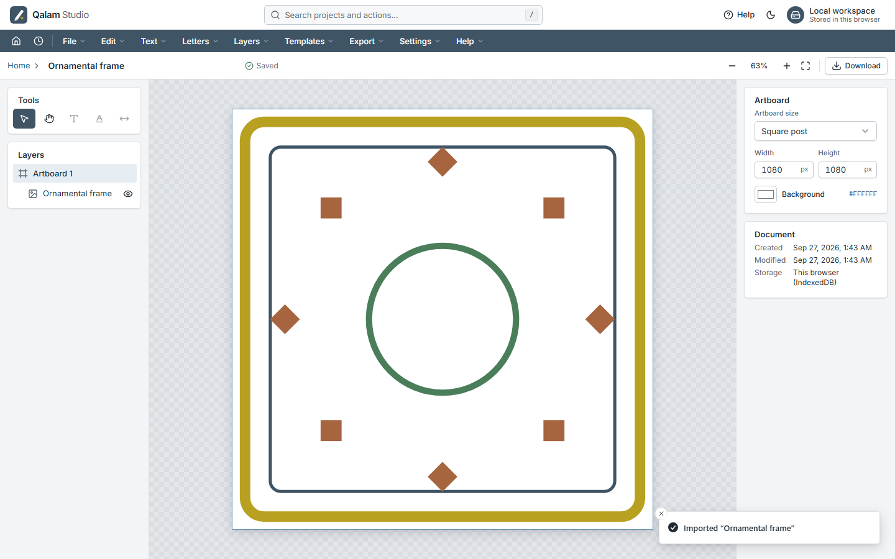
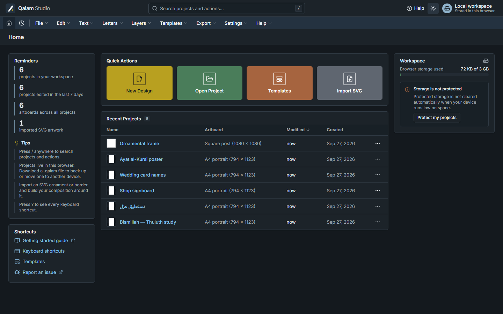
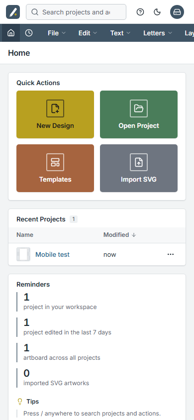

# Qalam Studio

**Open-source calligraphy editor for Arabic-script languages — in the browser, fully offline.**

Type Urdu, Arabic, Persian, Kurdish, Pashto or Sindhi text, render it in a calligraphic script
(Nastaliq, Naskh, Thuluth, Ruqaa, Kufi), then move, scale and rotate every letter body, dot
(nuqta), diacritic and kashida independently — while connected letters still look joined.
Inspired by desktop tools such as Kelk, built on the open web.

[](../../actions/workflows/ci.yml)
[](../../actions/workflows/deploy.yml)




| Urdu Nastaliq, shaped in the browser               | SVG artwork                            | Dark mode                                         | Mobile                                 |
| -------------------------------------------------- | -------------------------------------- | ------------------------------------------------- | -------------------------------------- |
|  |  |  |  |

## Live demo

Every push to `main` that passes CI is deployed to GitHub Pages at
**[abdulmanan69.github.io/qalam-studio](https://abdulmanan69.github.io/qalam-studio/)**. Your projects stay in your browser — nothing is uploaded.

## Features

New here? Read the **[user guide](docs/user-guide.md)** — a step-by-step guideline for every tool.

All seven phases of the [roadmap](docs/roadmap.md) are complete.

**Letters, dots and marks (phases 3–4)**

- ✅ Every glyph is split into its **body, dots and marks**; drill down **word → letter → part**
  (double-click / Enter, Esc to go back) and move, scale or rotate each piece on its own
- ✅ **Keep dots with their letter** lock, manual re-classification, hide, merge and split parts
- ✅ Editing the text keeps the adjustments of unchanged letters
- ✅ **Kashida**: tatweel re-shaping for Naskh fonts, smooth stroke stretching for Nastaliq and
  Ruqaa; drag tool (`K`) and slider
- ✅ **Alternate letter forms** from the font (`salt`, `swsh`, `ssNN`, `cvNN`) with previews
- ✅ **Baseline guides** with baseline snapping for stacked compositions
- ✅ **Letter styles**: twenty calligraphic shapes (wide, swash, lean, raised, kashida…) plus
  the font's alternates, for one letter across the whole text or only in a selected word
- ✅ **Position adjuster**: arrow pad and keys (¼, 1, 5, 10 px) for words, letters, dots and
  marks — with or without their dots and marks
- ✅ **Symbols panel**: honorifics (ﷺ …), Qur'anic marks with ayah numbers, all surah and para
  names — drawn in the current font, missing symbols hidden
- ✅ **Spacing tuner**: letter and word spacing and automatic even spacing for Nastaliq

**Publishing — newspapers, magazines, books**

- ✅ **Text frames** with columns; long stories **flow through linked frames** across pages, with
  overflow warnings and one-click continuation
- ✅ **Justified text with kashida** (or word spaces), right-to-left column order, first-line
  indents, paragraph spacing
- ✅ **Paragraph styles** (body, headline, subheading, byline, caption, your own)
- ✅ **Photos** (JPG/PNG/WebP/GIF) with fill-and-crop, and **text wrap** around any object
- ✅ **Page setup** with newspaper sizes (tabloid, Berliner, broadsheet), margins, column grid and
  bleed; **master pages** with automatic **page numbers**
- ✅ Print **PDF with crop marks and bleed**; newspaper, magazine and book templates

**Design tools (phase 5)**

- ✅ Layers panel: drag to reorder, lock, hide, rename, **groups**
- ✅ Fill (solid or **gradient**), outline, opacity, **shadow**; exact position, scale, rotation
- ✅ Unlimited **undo/redo**, instant autosave, **version history** with named versions
- ✅ Export **SVG**, **PNG** (1×, 2×, 4× or custom DPI, written into the file) and vector **PDF**
- ✅ Multiple **artboards**; rulers, grid, snapping, smart guides, symmetry axes, mirror copy
- ✅ Copy/paste (also between tabs), duplicate, align, distribute, flip, nudge, place SVG

**Templates, languages, offline (phase 6)**

- ✅ Template gallery (Bismillah, names, logos, poetry, frames) and original ornaments, frames and
  background patterns
- ✅ Interface in **English, Urdu, Arabic and Persian** with right-to-left layout
- ✅ Installable **offline PWA** — fonts and the shaping engine are cached

**Quality (phase 7)**

- ✅ Unit, component and end-to-end tests (including dot editing and export) and automated
  **axe accessibility** checks in English and Urdu
- ✅ **Storybook** component workshop (`npm run storybook`) with language and theme switchers

**Phase 2 — text shaping**

- ✅ HarfBuzz (WebAssembly) shaping in a Web Worker: contextual forms, ligatures, mark positioning
  and the Nastaliq cascading baseline — independent of the browser's own text rendering
- ✅ Glyph outlines from opentype.js drawn as vector paths on a Fabric.js canvas
- ✅ 8 bundled OFL fonts (Nastaliq, Naskh, Ruqaa, Kufi, display) with a validated font registry
- ✅ Text tool (`T`) with an on-screen Urdu / Arabic / Persian keyboard (letters, harakat, digits)
- ✅ Text properties: content, language, font (with live previews), size, line height, alignment,
  color, position, scale, rotation; move, scale, rotate and flip directly on the canvas
- ✅ Six content languages: Urdu, Arabic, Persian, Kurdish (Sorani), Pashto, Sindhi
- ✅ Document schema v2 with automatic migration of existing projects and `.qalam` files

**Phase 1 — foundation**

- ✅ Enterprise app shell: top bar with command search, slate navigation menus, light/dark themes
- ✅ Dashboard: quick actions, sortable recent-projects table, reminders, storage health
- ✅ Projects stored locally in IndexedDB with autosave; rename, duplicate, delete with undo
- ✅ Artboard presets (A4, A3, square post, story, banner, HD, custom), `.qalam` files, SVG import
- ✅ Zoom (Ctrl + wheel, pinch, shortcuts), pan (hand tool / Space), layers and properties panels
- ✅ Keyboard shortcuts (`?`), full keyboard navigation, WCAG 2.1 AA colors
- ✅ CI (lint, type-check, unit + e2e tests, build) and automatic GitHub Pages deployment

## Quick start

Requirements: **Node.js 22** (see `.nvmrc`) and npm.

```bash
git clone https://github.com/abdulmanan69/qalam-studio.git
cd qalam-studio
npm install
npm run dev          # http://localhost:5173
```

| Command                 | What it does                                    |
| ----------------------- | ----------------------------------------------- |
| `npm run dev`           | Start the dev server with hot reload            |
| `npm run build`         | Type-check and build the static site to `dist/` |
| `npm run preview`       | Serve the production build locally              |
| `npm test`              | Unit and component tests (Vitest)               |
| `npm run test:coverage` | Tests with a coverage report                    |
| `npm run test:e2e`      | End-to-end tests (Playwright, Chromium)         |
| `npm run lint`          | ESLint (type-aware, accessibility rules)        |
| `npm run typecheck`     | TypeScript strict mode check                    |
| `npm run format`        | Prettier                                        |
| `npm run storybook`     | Component workshop at http://localhost:6006     |
| `npm run icons`         | Regenerate the PWA icons from `favicon.svg`     |

First e2e run: `npx playwright install chromium`.

## Deploying your own copy

1. Fork or push this repository to GitHub.
2. **Settings → Pages → Build and deployment → Source: GitHub Actions.**
3. Push to `main`. The `CI` workflow runs; when it passes, `Deploy to GitHub Pages` publishes the site.

The deploy workflow sets Vite's `base` to `/<repository>/` automatically (or `/` for
`<owner>.github.io` repositories). Routing uses hash URLs (`#/editor/…`), so deep links work on
GitHub Pages without server rewrites. Details: [docs/deployment.md](docs/deployment.md).

## How to add a font

A font is added with **one folder and one JSON entry** — no code changes:

1. Create `public/fonts/<font-id>/` containing the font file (`.ttf`/`.otf`/`.woff2`) **and its
   license** (`OFL.txt`). Only open-licensed fonts (SIL OFL 1.1 or compatible) are accepted.
2. Add an entry to `src/features/fonts/registry.json` (id, display name, script style, file,
   license, supported languages).
3. Run `npm test`. The registry tests check that the file and license exist, and that the font
   really contains every letter of each language it claims to support.

Optional: set `"kashida": "stretch"` for scripts where tatweel is not used (Nastaliq, Ruqaa).

Bundled fonts and their sources: [public/fonts/README.md](public/fonts/README.md). Full guide:
[docs/adding-fonts.md](docs/adding-fonts.md).

## Architecture in brief

```
src/
  app/                routing (HashRouter), providers, global stores
  components/ui/      shadcn/ui components (Radix primitives + Tailwind)
  components/layout/  app shell: top bar, navigation, search, dialogs
  features/
    dashboard/        home page
    editor/           editor: document store (undo/redo), canvas stage, panels, exporters
    ornaments/        original ornaments, frames and patterns (generated SVG)
    projects/         data model (zod), IndexedDB (Dexie), .qalam files, SVG import
    shaping/          HarfBuzz + opentype.js engine (framework-free) and its Web Worker
    fonts/            font registry, font picker, preview loading
    templates/        templates gallery
  i18n/               react-i18next setup and locale files
  lib/                framework-agnostic helpers
  styles/             design tokens (CSS variables) and Tailwind entry
```

- **100 % static**: no backend, no accounts, no analytics. Data lives in IndexedDB on your device.
- **Typed document model**: zod schemas are the single source of truth for TypeScript types and
  `.qalam` validation.
- **Design tokens**: every color is a CSS variable, so light/dark (and future themes) are a CSS swap.

More in [docs/architecture.md](docs/architecture.md).

## Contributing

Contributions are welcome — code, fonts, templates, translations and bug reports.
Read [CONTRIBUTING.md](CONTRIBUTING.md) and our [Code of Conduct](CODE_OF_CONDUCT.md).
Security issues: see [SECURITY.md](SECURITY.md).

## License

Code: [MIT](LICENSE). Fonts keep their own licenses (SIL Open Font License), shipped next to each font.

## Author

Created and maintained by **Abdul Manan** — [@abdulmanan69](https://github.com/abdulmanan69).
